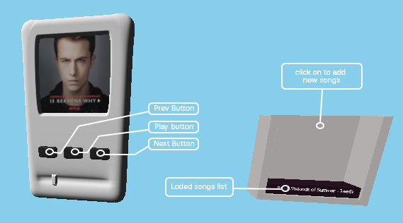

# Three.js 3D Music Player 🎶

This is an interactive 3D music player built using Vite vanilaJs with Three.js

This is 3D model Of Music players
# 🎹 Button Guide

 
1. Click "Prev button" to go back to the previous track.

2. Click "Play/Pause" to play or pause the current track.

3. Click "Next Song" to skip to the next track.

4. Use the file input to browse and add songs from your